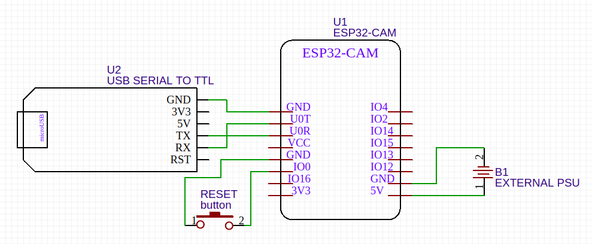

# ESP32-CAM - A.I. Thinker

The goal of this repository is to centralize information and examples for the ESP32-CAM A.I. Thinker.

[Read the board and periferals specifications here.](./docs/about-esp32-cam.md)

>  
> ESP32-CAM A.I. Thinker usually sells with OV2640 sensor

# Capabilities

This board and the included OV2640 can acomplish the following:

- External 64MBit PSRAM ([IPUS IPS6404](./assets/IPUS_IPS6404_Datasheet.pdf))
- Embeed flash light
- Sd Card
  - mount using FatFS
- Ov2640
  - Native resolutions:
    - UXGA
    - SVGA
    - CIF
  - Gain control
  - Balance control
  - Windowing
    - Zoom and panning modes
    - Sub-sampling mode
      - Svga
      - Cif
  - Frame exposure mode
  - Output formatter
    - Scaling image output
  - Power down mode
  - Strobe (flash control)

# Flashing

## Requirements

To flash the board you need a USB to TTL dongle.

Also it is very important to **use a external power supply**. USBs usually do not provide sufficient current which makes the board loops `brownout` errors.

## Wiring

>  
> Diagram to wire the board

## Instructions

When flashing:

1. turn the board down
2. hold the reset button (short `GPIO0` to `GND`)
3. turn the board on

When booting to run your sketch keep `GPIO0` open.

This board also has a built in reset button.

# Examples

To run the examples, make sure to have `xtensa` and `esp-idf` configured in your machine. If you haven't, refer to [this tutorial](https://docs.espressif.com/projects/esp-idf/en/latest/get-started/index.html).

- [JPG via Http server](./examples/http_jpg)
- [Store pictures in SD](./examples/sd_jpg)

# Contributions

The roadmap for this repository is to implement examples uppon the capabilities of the board.

Feel free to open issues, describe bugs, suggest new examples and implementations.

I'll be reviewing and accepting PR's.
