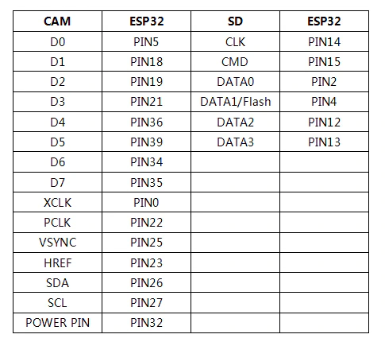
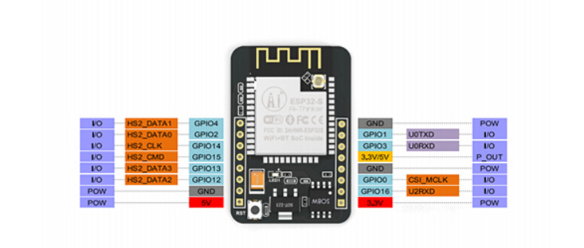
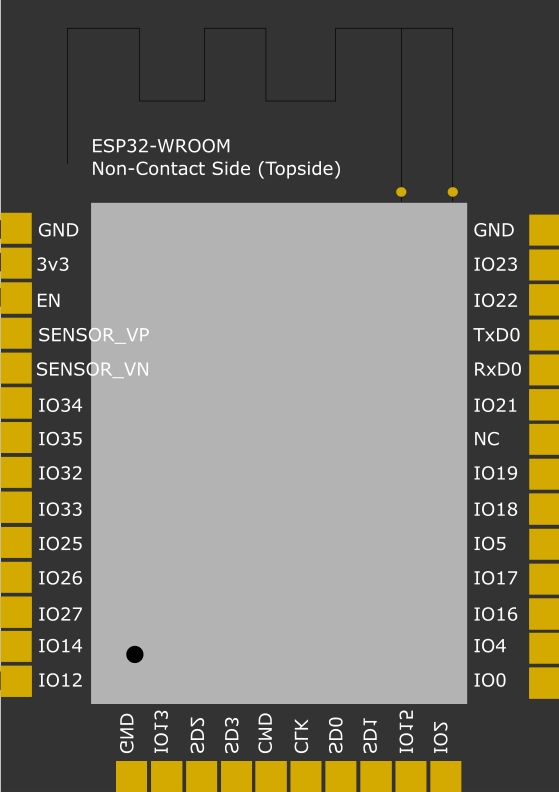
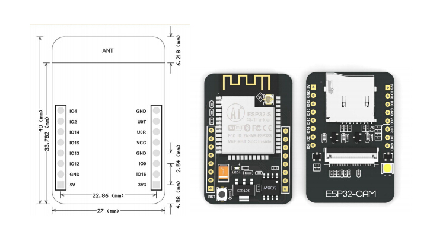

# About ESP32-CAM

This document refers to the board itself and its hardware features.

- [Board datasheet](../assets/ESP32-CAM_Product_Specification.pdf)
- [IPUS IPS6404 datasheet](../assets/IPUS_IPS6404_Datasheet.pdf): external memory
- [OV2640 datasheet](../assets/OV2640_Datasheet.pdf): included camera
  - [OV2640 FSL package](../assets/OV2640FSL_Datasheet.pdf)

# PINs

[What can/can't pins be used for? (complete guide)](./esp32cam-pin-notes.md)

Internal pins table table

External pins layout

# ESP32s

Mounted ESP32s pins

# Dimensions

board dimensions

