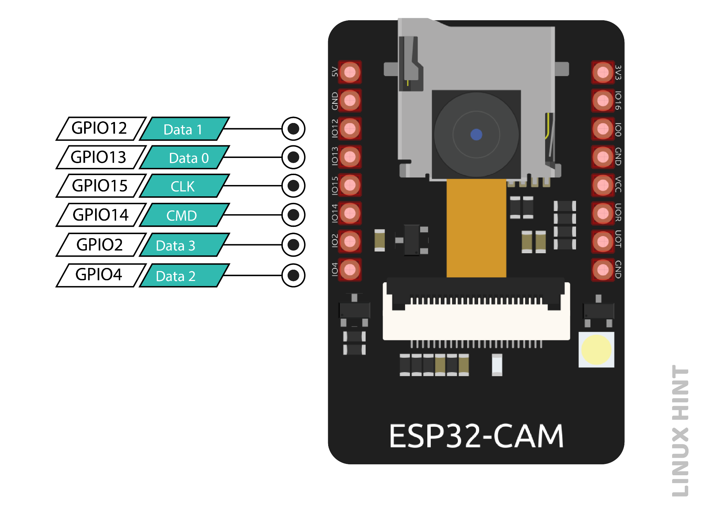
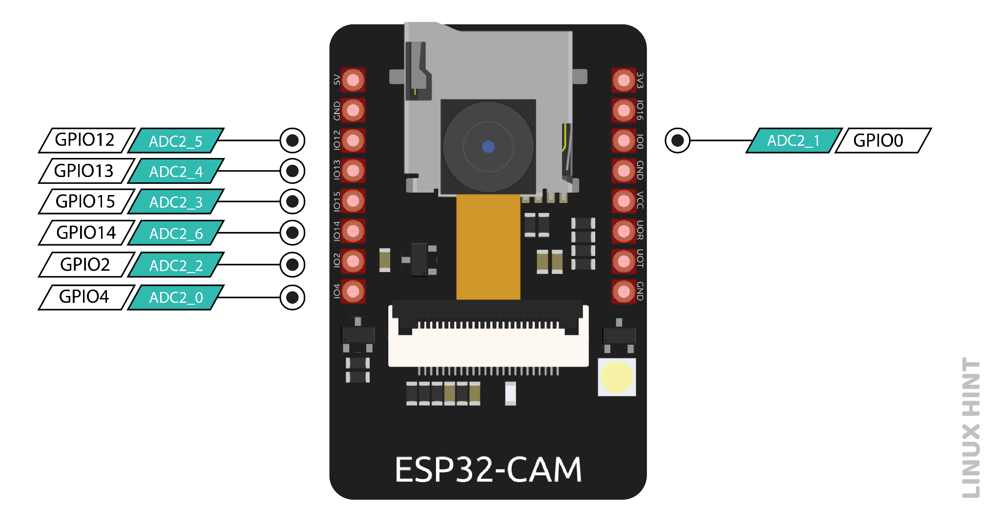
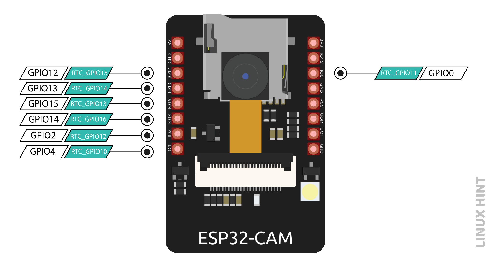
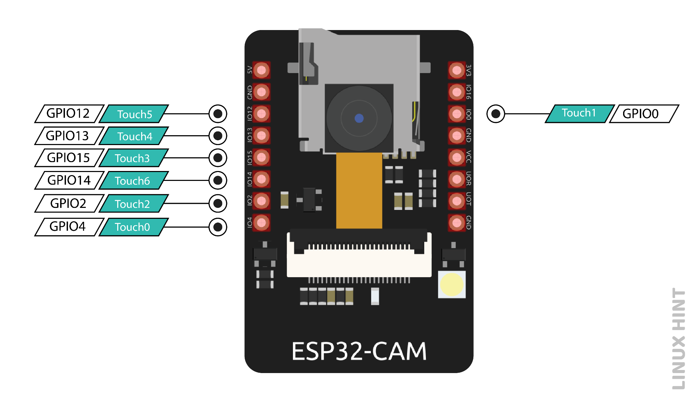
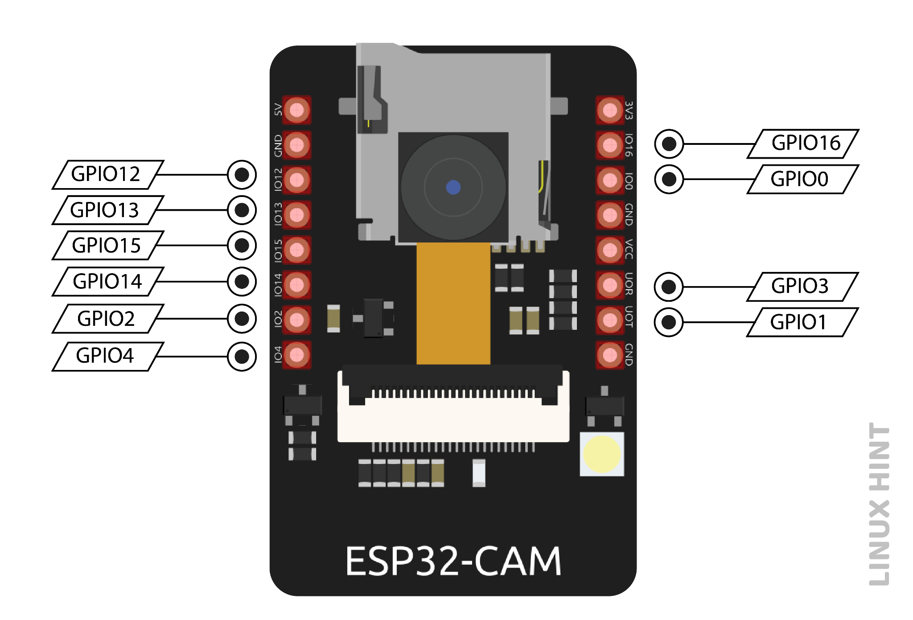

# Pin Notes

You'll discover most of the pins on the ESP32 cam are already used or have wonky behaviors.  
To make matters a bit more confusing the layout seems to be done by a inebriated engineer or (more likely) a trace auto-router. 
Some of those poor decisions (e.g. not exposing the I2C pins) significantly cripple the possible applications. 
However pins listed as "not exposed" could be accessible using a soldering iron, or a custom FPC in the camera interface.

## Table of contents

- [Pin Notes](#pin-notes)
  - [Table of contents](#table-of-contents)
  - [GPIO General Purpose](#gpio-general-purpose)
  - [Assignment](#assignment)
    - [Power Pins](#power-pins)
    - [Power output pin](#power-output-pin)
    - [UART / Serial Pins](#uart--serial-pins)
    - [Micro SD card pins](#micro-sd-card-pins)
    - [ADC pins](#adc-pins)
    - [RTC GPIO Pins (Interrupt)](#rtc-gpio-pins-interrupt)
    - [SPI pins](#spi-pins)
    - [Touch Pins](#touch-pins)
    - [PWM pins](#pwm-pins)
    - [sources](#sources)
  - [GPIO0 - CAM\_PIN\_XCLK or CSI\_MCLK](#gpio0---cam_pin_xclk-or-csi_mclk)
  - [GPIO1 - U0TXD](#gpio1---u0txd)
  - [GPIO2 - HS2\_DATA0 (IO2) MISO](#gpio2---hs2_data0-io2-miso)
  - [GPIO3 - U0RXD](#gpio3---u0rxd)
  - [GPIO4 - HS\_DATA1  - Flashlight](#gpio4---hs_data1----flashlight)
  - [GPIO5 - (not exposed)](#gpio5---not-exposed)
  - [GPIO6 - (not exposed)](#gpio6---not-exposed)
  - [GPIO7 - (not exposed)](#gpio7---not-exposed)
  - [GPIO8 - (not exposed)](#gpio8---not-exposed)
  - [GPIO9 - (not exposed)](#gpio9---not-exposed)
  - [GPIO10 - (not exposed)](#gpio10---not-exposed)
  - [GPIO11 - (not exposed)](#gpio11---not-exposed)
  - [GPIO12 - HS2\_DATA2](#gpio12---hs2_data2)
  - [GPIO13 - HS2\_DATA3](#gpio13---hs2_data3)
  - [GPIO14 - HS2\_CLK SCK](#gpio14---hs2_clk-sck)
  - [GPIO15 - HS2\_CMD](#gpio15---hs2_cmd)
  - [GPIO16 - U2RXD "useless gpio"](#gpio16---u2rxd-useless-gpio)
  - [GPIO17 - (not exposed) PSRAM\_CLK](#gpio17---not-exposed-psram_clk)
  - [GPIO18 - (not exposed)](#gpio18---not-exposed)
  - [GPIO19 - (not exposed)](#gpio19---not-exposed)
  - [GPIO20 - ??](#gpio20---)
  - [GPIO21 - (not exposed)](#gpio21---not-exposed)
  - [GPIO22 - (not exposed)](#gpio22---not-exposed)
  - [GPIO23 - (not exposed)](#gpio23---not-exposed)
  - [GPIO24 - (not exposed) - ??](#gpio24---not-exposed---)
  - [GPIO25 - (not exposed)](#gpio25---not-exposed)
  - [GPIO26 - (not exposed)](#gpio26---not-exposed)
  - [GPIO27 - (not exposed)](#gpio27---not-exposed)
  - [GPIO28 - (not exposed)](#gpio28---not-exposed)
  - [GPIO29 - (not exposed)](#gpio29---not-exposed)
  - [GPIO30 - (not exposed)](#gpio30---not-exposed)
  - [GPIO31 - (not exposed)](#gpio31---not-exposed)
  - [GPIO32 - (not exposed)](#gpio32---not-exposed)
  - [GPIO33 - (sort of exposed) pcb LED](#gpio33---sort-of-exposed-pcb-led)
  - [GPIO34 - (not exposed)](#gpio34---not-exposed)
  - [GPIO35 - (not exposed)](#gpio35---not-exposed)
  - [GPIO36 - (not exposed)](#gpio36---not-exposed)
  - [GPIO37 - (not exposed)](#gpio37---not-exposed)
  - [GPIO38 - (not exposed)](#gpio38---not-exposed)
  - [GPIO39 - (not exposed)](#gpio39---not-exposed)


## GPIO General Purpose
Out of 32 total GPIO pins, there are only 10 GPIO pins available for ESP-32 CAM, as the rest of the pins are internally used for PSRAM and camera. By programming the proper registers these pins can be assigned with multiple peripheral duties such as touch, SPI, UART, and ADC.

According to the ESP32_S docs "Any GPIO Pins" can be used to:

* Motor PWM 
* Three channels of 16bit timers generate PWM waveforms, three fault detection signals, three event capture signals, three sync signals
* Two UART Devices with hardware flow control & DMA
* I2C
* devices in slave or master mode
* I2S
* Stereo input/output, Parallel LCD data output, Parallel Camera Data input
* Infrared Remote Controller
* Eight channels for an IR transmitter & receiver of various waveforms
* General Purpose SPI
* LED PWM (16 independent channels @80mhz with duty accuracy of 16bits), 
* Pulse Counter (pcnt_sig_ch[0-1]_in[0-7])
* Signals: EMAC_MDC_out, EMAC_MDI_in, EMAC_MDO_out, EMAC_CRS_out, EMAC_COL_out - Ethernet MAC MII/RII interface


## Assignment

### Power Pins

The ESP32-CAM comes with three `GND` pins (colored in black color) and two power pins (colored with red color): `3.3V` and `5V`.

You can power the ESP32-CAM through the `3.3V` or `5V` pins. However, many people reported errors when powering the ESP32-CAM with 3.3V, so we always advise to power the ESP32-CAM through the 5V pin.

### Power output pin
There’s also the pin labeled on the silkscreen as `VCC` (colored with a yellow rectangle). You should not use that pin to power the ESP32-CAM. That is an output power pin. It can either output `5V` or `3.3V`.

In our case, the ESP32-CAM outputs 3.3V whether it is powered with 5V or 3.3V. Next to the VCC pin, there are two pads. One labeled as 3.3V and other as 5V. The 5V power can be made available on the VCC, by unsoldering the 3.3 V pad and making a jumper connection with the 5V pad.

### UART / Serial Pins
There are two interfaces of UART, UART0 AND UART2 on the ESP-32 S chip. The **GPIO 1** (Tx), **GPIO 3** (Rx), and **GPIO 16** (Rx 2) are three serial pins. Serial pins are responsible for communication. The only pin of UART2 (GPIO 16) is broken out, so it doesn’t take part in communication and makes UART0 the only usable UART on the chip. ESP32 doesn’t have a built-in programmer, so the GPIO 1 pin is used to transmit and GPIO 3 is used to receive the data. These pins make communication connections and upload code to the board.

### Micro SD card pins
All the microSD card pins are multipurpose, when the SD card is not in use, then these pins can be used as normal input/output pins.

If you’re not using the microSD card, you can use these pins as regular inputs/outputs. You can take a look at the [ESP32 pinout guide](https://randomnerdtutorials.com/esp32-pinout-reference-gpios/) to see the features of these pins.

All these GPIOs are RTC and support ADC: GPIOs 2, 4, 12, 13, 14, and 15.

<details>

<summary>pins</summary>



</details>

### ADC pins
ADC (Analog to Digital converter) pins are capable of changing analog signal to digital signal. The ADC converts voltage into a bit which is understandable by the microprocessor. The ADC input channel has a 12-bit resolution, which means the readings can range from 0 to 4095, in which 0 will respond to 0V and 4095 will respond to 3.3V. ADC2 pins are internally used by the Wi-Fi driver, so they cannot be used when Wi-Fi is on. When Wi-Fi is on, there is trouble getting output from the ADC2 GPIO.

<details>

<summary>pins</summary>



</details>

### RTC GPIO Pins (Interrupt)
An external interrupt means an external interference in the normal functioning of the system. This interrupt can come from the user or any other device present among the networks. A common use of interrupts in ESP32-CAM is to wake up the microcontroller to perform a task. In ESP32-CAM, GPIO pins which are highlighted below can be configured as interrupts. These RTC GPIO pins are routed to the low-power subsystem; when an ultra-power coprocessor is running, these pins wake the ESP32 from sleep.

<details>

<summary>pins</summary>



</details>

### SPI pins
Serial Peripheral Interrupt (SPI) is a protocol for data communication that is used by a microcontroller to communicate with another or more than one external device and makes a bus-like connection. In SPI communication, there is a Master and a Slave. The master decides which operation to perform, and the slave accepts the command.
<details>

<summary>pins</summary>


</details>

### Touch Pins
The ESP32-CAM has 7 internal capacitive touch sensing GPIOs, which can detect changes in anything that contains charge, such as human skin. When anything possessing charge comes to proximity, it can sense and detect variations in capacitance.
A capacitive touchpad can be made by attaching any conducting material to these pins, which can replace mechanical buttons.

<details>

<summary>pins</summary>



</details>

### PWM pins
All the 10 GPIOs can be used as PWM pins, and they are operated by a PWM controller.  
The PWM controller has a PWM operator, a dedicated capture submodule, and PWM timers. The PWM timer generates timing in independent or synchronous form, the operator generates the waveform for the channel and the capture submodule captures events with external timing.

<details>

<summary>pins</summary>



</details>

### sources
[ESP32 pinout guide](https://randomnerdtutorials.com/esp32-pinout-reference-gpios/),
[Linux Hint](https://linuxhint.com/esp32-cam-pinout/), 
[Random Nerd](https://randomnerdtutorials.com/esp32-cam-ai-thinker-pinout),
as well as Abish Vijayan [Github](https://github.com/abish7643/ESP32Cam-I2CSensors) and his 
[blog](https://3iinc.xyz/blog/how-to-use-i2c-sensor-bme280-with-esp32cam/)


## GPIO0 - CAM_PIN_XCLK or CSI_MCLK 
GPIO 0 is a mode selection pin. When the GPIO0 is connected to the ground to make it low, it enables the flash mode. In flash mode, the code is flashed to the board. To disable the flash mode, the connection of this pin with the GND pin is removed. The microcontroller returns to the normal program execution mode.

* Pull to ground (at reset) to put board into flash mode
* Internally has a 3.3v 10k pullup resistor (R19)
* CSI_MCLK is used by Camera (line 12 on FPC) 
* strapping pin - [ESP32_S datasheet](https://www.espressif.com/sites/default/files/documentation/esp32_datasheet_en.pdf), default:pull-up spi-boot:1, download-boot:0
* Supports Capactive Sensing T1 (see ESP32_S datasheet section 4.1.5 "Touch Sensor")
* ADC2_CH1- 12bit SAR ADC
* Signal: HSPIHD - Parallel QSPI
* Signal: EMAC_TX_CLK - Ethernet MAC MII/RII interface
* listed in ESP32_S datasheet as "RTC_Function2" I2C_SDA
* designated as a (wpu) "weak pull up" by ESP32_S datasheet v3.4 pg53 IO/Mux Addendum

## GPIO1 - U0TXD
* used for serial output
* designated as OUTPUT ONLY

## GPIO2 - HS2_DATA0 (IO2) MISO
* Used by SD-Card
* Usable as a SPI MISO ([reference](https://github.com/raphaelbs/esp32-cam-ai-thinker/issues/55))
* strapping pin - [ESP32_S datasheet](https://www.espressif.com/sites/default/files/documentation/esp32_datasheet_en.pdf), default:pull-down -- must be down to download boot on GPIO0)
* Supports Capactive Sensing T2 (see ESP32_S datasheet section 4.1.5 "Touch Sensor")
* ADC2_CH2- 12bit SAR ADC, SD Memory card v3.01 
* Signal: HSPIWP - Parallel QSPI
* designated as a (wpd) "weak pull down" by ESP32_S datasheet v3.4 pg53 IO/Mux Addendum

## GPIO3 - U0RXD
* used for serial input
* Signal: EMAC_RXD2 - Ethernet MAC MII/RII interface
* designated as I1? (input only?) 

## GPIO4 - HS_DATA1  - Flashlight
ESP-32 CAM has an inbuilt flash LED light. This is used to take pictures in the dark. This flashlight is connected to the GPIO4 pin. The GPIO 4 pin is also connected to the micro-SD card, so it needs to be programmed well when using both functions together  – the flashlight will light up when using the microSD card (see note).


* Used by SD Card
* has a 47Kohm resistor (R11) on the SD1/MicroSD line
* connected to onboard 3030 SMD LED (Flashlight) 
* might be usable as a SPI MOSI (need to verify)
* Supports Capactive Sensing T0 (see ESP32_S datasheet section 4.1.5 "Touch Sensor")
* ADC2_CH0- 12bit SAR ADC, Supports SD Memory Card v3.01
* Signal: EMAC_TX_ER - Ethernet MAC MII/RII interface
* listed in ESP32_S datasheet as "RTC_Function2" I2C_SCL
* designated as a (wpd) "weak pull down" by ESP32_S datasheet v3.4 pg53 IO/Mux Addendum
  
**Note** :  if you initialize the microSD card as follows, you won’t have this problem because the microSD card won’t use that data line.*

1-bit SD Card 'hack' initialize the microSD card as follows, then the microSD card won’t use the GPIO4, GPIO12, GPIO13 data lines (HS_DATA1, HS_DATA2, HS_DATA3 respectively)!  
  ```
  // enable SD_MMC in menuconfig > Arduino section
  #include "SD_MMC.h"
  ...
  SD_MMC.begin("/sdcard", true)
  ```
  
  The LED will not make that flash effect. However, the LED remains on with low brightness.
  
  https://randomnerdtutorials.com/esp32-cam-ai-thinker-pinout/ 

## GPIO5 - (not exposed)
* CSI_D0 esp_camera.h:CAM_PIN_D0 -> Camera FPC Y2
* strapping pin - [ESP32_S datasheet](https://www.espressif.com/sites/default/files/documentation/esp32_datasheet_en.pdf), default:pull-up w/GPIO5 controls Timing of SDIO slave (see documentation) 
* Signal: VSPICS0 - Parallel QSPI
* Signal: EMAC_RX_CLK - Ethernet MAC MII/RII interface

## GPIO6 - (not exposed)
* SD_CLK, HS1_CLK
* SPICLK - Parallel QSPI

## GPIO7 - (not exposed)
* SD_DATA0, HS1_DATA0

## GPIO8 - (not exposed)
* SD_DATA1, HS1_DATA1

## GPIO9 - (not exposed)
* SD_DATA2, HS1_DATA2
* SPIHD - Parallel QSPI

## GPIO10 - (not exposed)
* SD_DATA3, HS1_DATA3
* SPIWP - Parallel QSPI

## GPIO11 - (not exposed)
* SD_CMD, HS1_CMD
* SPICS0 - Parallel QSPI

## GPIO12 - HS2_DATA2 
* ESP32_S datasheet reference: MTDI
* Hint: use the SD-Card 1bit mode trick described on GPIO4 to use this pin!
* used as strapping pin - [ESP32_S datasheet](https://www.espressif.com/sites/default/files/documentation/esp32_datasheet_en.pdf),  default:pull-down selects voltage (3.3v:0, 1.8v:1)    
* Supports Capactive Sensing T5 (see ESP32_S datasheet section 4.1.5 "Touch Sensor")
* JTAG, ADC2_CH5- 12bit SAR ADC
* Signal HSPIQ - Parallel QSPI
* Signal: EMAC_TXD3 - Ethernet MAC MII/RII interface
* also RTC_GPIO15
* MTDI (GPIO12) is used as a bootstrapping pin to select the output voltage of an internal regulator (VDD_SDIO) which powers the flash chip.
* when connected as SDA (for I2C) causes "RTCWDT_RTC_REST"exception ets_main.c 371 at boot due to flash voltage not being set properly. 
* To resolve: it is (Recommended) by EspressIf to Burn the flash voltage selection eFuses. This will permanently configure the internal regulator’s output voltage to 3.3 V, and GPIO12 will not be used as a bootstrapping pin. After that, connect a pull-up resistor to GPIO12.
* Reference & Instructions: [overview of compatibility](https://docs.espressif.com/projects/esp-idf/en/latest/esp32/api-reference/peripherals/sd_pullup_requirements.html#compatibility-overview-espressif-hw-sdio)

## GPIO13 - HS2_DATA3
* ESP32_S datasheet: MTCK
* Hint: use the SD-Card 1bit mode trick described on GPIO4 to use this pin!
* Supports Capactive Sensing T4 (see ESP32_S datasheet section 4.1.5 "Touch Sensor")
* JTAG, ADC2_CH4- 12bit SAR ADC, SD Memory card v3.01
* Signal HSPID - Parallel QSPI
* Signal: EMAC_RX_ER - Ethernet MAC MII/RII interface

## GPIO14 - HS2_CLK SCK
* ESP32_S datasheet: MTMS 
* Usable as an SPI CLK ([reference](https://github.com/raphaelbs/esp32-cam-ai-thinker/issues/55))
* Supports Capactive Sensing T6 (see ESP32_S datasheet section 4.1.5 "Touch Sensor")
* JTAG, ADC6_CH0- 12bit SAR ADC, SD memory card v3.01
* Signal: HSPICLK - Parallel QSPI
* Signal: EMAC_TXD2 - Ethernet MAC MII/RII interface
* also RTC_GPIO16

## GPIO15 - HS2_CMD
* ESP32_S datasheet: MTDO
* might be usable as an SPI CS/CMD (need to verify)
* strapping pin - [ESP32_S datasheet](https://www.espressif.com/sites/default/files/documentation/esp32_datasheet_en.pdf), default:pull-up enable/disable debugging log print over U0TXD during boot (active:1, silent:0)
* Supports Capactive Sensing T3 (see ESP32_S datasheet section 4.1.5 "Touch Sensor")
* JTAG, ADC2_CH3- 12bit SAR ADC
* Signal HSPICS0 - Parallel QSPI
* Signal: EMAC_RXD3 - Ethernet MAC MII/RII interface
* designated as a (wpu) "weak pull up" by ESP32_S datasheet v3.4 pg53 IO/Mux Addendum

## GPIO16 - U2RXD "useless gpio" 
* is not RTC (can't be used for pwm or precision measurement) 
* Note that GPIO 16 is not an ADC pin, so you can’t read analog sensors on this pin.
* Additionally, GPIO 16 is not an RTC GPIO, so it can’t be used as an external wake-up source. 
* has a 10Kohm pull-up resistor
* is connected to CS# pin1 of onboard PSRAM64 (64Mbit/8mb CMOS SRAM) that is required for *most* high resolution camera applications
* Signal: EMAC_CLK_OUT - Ethernet MAC MII/RII interface

## GPIO17 - (not exposed) PSRAM_CLK 
* Signal: EMAC_CLK_OUT_180 - Ethernet MAC MII/RII interface

## GPIO18 - (not exposed)
* CSI_D1 esp_camera.h:CAM_PIN_D1 -> Camera FPC Y3
* Signal VSPICLK - Parallel QSPI

## GPIO19 - (not exposed)
* CSI_D2 esp_camera.h:CAM_PIN_D2 -> Camera FPC Y4 
* Signal VSPIQ - Parallel QSPI
* Signal: EMAC_TXD0 - Ethernet MAC MII/RII interface

## GPIO20 - ??

## GPIO21 - (not exposed)
* esp_camera.h:CAM_PIN_D3 -> Camera FPC Y5
* Signal VSIHD - Parallel QSPI
* Signal: EMAC_TX_EN - Ethernet MAC MII/RII interface

## GPIO22 - (not exposed)
* CS1_PCLK   esp_camera.h:CAM_PIN_PCLK
* Signal VSPIWP - Parallel QSPI
* Signal: EMAC_TXD1 - Ethernet MAC MII/RII interface

## GPIO23 - (not exposed)
* CS1_HSYNC  esp_camera.h:CAM_PIN_HREF
* Signal VSPID - Parallel QSPI

## GPIO24 - (not exposed) - ??

## GPIO25 - (not exposed)
* esp_camera.h:CAM_PIN_VSYNC -> Camera FPC CS1_VSYNC
* DAC_1, ADC2_CH8- 12bit SAR ADC
* Signal: EMAC_RXD0 - Ethernet MAC MII/RII interface
* also RTC_GPIO6

## GPIO26 - (not exposed)
* TW1_SDA esp_camera.h:CAM_PIN_SIOD -> Camera FPC SIO_D TW1_SCK (line 20)
* could be used for I2C SDA (if it was exposed) 
* has 4.7k (R17) resistor, maybe retrofittable with a wire (but unsure of location)
* DAC_2, ADC2_CH9- 12bit SAR ADC
* Signal: EMAC_RXD1 - Ethernet MAC MII/RII interface
* also RTC_GPIO7

## GPIO27 - (not exposed)
* TW1_SCK esp_camera.h:CAM_PIN_SIOC ->  Camera FPC SIO_C TW1_SCK (line 22)
* could be used for I2C SCL (if it was exposed) 
* has 4.7k (R18) resistor, maybe retrofittable with a wire (but unsure of location)
* Supports Capactive Sensing T7 (see ESP32_S datasheet section 4.1.5 "Touch Sensor")
* ADC2_CH7- 12bit SAR ADC
* Signal: EMAC_RX_DV - Ethernet MAC MII/RII interface
* also RTC_GPIO17

## GPIO28 - (not exposed) 
* ?? not defined in the ESP32_S specifications

## GPIO29 - (not exposed) 
* ?? not defined in the ESP32_S specifications

## GPIO30 - (not exposed) 
* ?? not defined in the ESP32_S specifications

## GPIO31 - (not exposed) 
* ?? not defined in the ESP32_S specifications

## GPIO32 - (not exposed)
* esp_camera.h:CAM_PIN_PWDN - Reset Switch "K1"
* Analog Pin name: 32K_XP 
* esp32cam pcb line has a 0.1uF coupled to GND
* esp32cam pcb line has 3.3v 10Kohm (R6) pullup
* ADC1_CH4
* Supports Capactive Sensing T9 (see ESP32_S datasheet section 4.1.5 "Touch Sensor")
* also RTC_GPIO9

## GPIO33 - (sort of exposed) pcb LED
* Analog pin name: 32K_XN 
* Supports Capactive Sensing T8 (see ESP32_S datasheet section 4.1.5 "Touch Sensor")
* Is connected to the internal BLUE(authentic)/RED(clone) LED on the PCB.
* If this is on, the WIFI won't work. 
* ADC1_CH5
* also RTC_GPIO8
* That LED works with inverted logic, so you send a `LOW` signal to turn it on and a `HIGH` signal to turn it off.
* 
## GPIO34 - (not exposed)
* esp_camera.h:CAM_PIN_D6 -> Camera FPC Y8
* Analog pin name: VDET_1
* ADC1_CH6
* also RTC_GPIO4

## GPIO35 - (not exposed)
* esp_camera.h:CAM_PIN_D7 
* Analog pin: VDET_2
* ADC1_CH7
* also RTC_GPIO5

## GPIO36 - (not exposed)
* esp_camera.h:CAM_PIN_D4
* Analog pin name: SENSOR_VP
* ADC1_CH0
* also RTC_GPIO0

## GPIO37 - (not exposed) 
* Analog pin name: SENSOR_CAPP
* ADC1_CH1
* also RTC_GPIO1

## GPIO38 - (not exposed) 
* Analog pin name: SENSOR_CAPN
* ADC1_CH2
* also RTC_GPIO2

## GPIO39 - (not exposed)
* esp_camera.h:CAM_PIN_D5 -> Camera FPC Y9
* Analog pin name: SENSOR_VN
* ADC1_CH3
* also RTC_GPIO3
