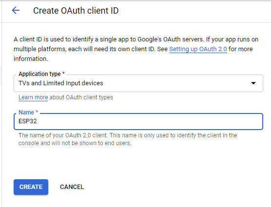

# Example google_storage

Connects with Google Cloud Storage using OAuth2, takes pictures every 20 seconds and upload it to the cloud.

## Requirements

- A Firebase project or a Google Cloud Storage bucket
- An `OAuth2 client ID` of type `other` in [google cloud credential manager](https://console.cloud.google.com/apis/credentials).
- An authorized `device_code`

This example relies on Google's API. Recommended read:
- [documentation for OAuth2ForDevice](https://developers.google.com/identity/protocols/OAuth2ForDevices)
- [documentation about OAuth2 protocol](https://developers.google.com/identity/protocols/OAuth2)

## Steps

### Step 0: Create a Firebase project / GCP project

This is step is a no-brainer.

### Step 1: Configure your Google Credential

Register a new `OAuth client ID` credential in [google cloud credential manager](https://console.cloud.google.com/apis/credentials). Make sure the right project is selected.


Make sure to select application type as `TVs and Limited Input devices`:



Save the newly generated `client ID` and `client secret`:


**Be aware that personal data show in examples will not work you.**

### Step 2: Create a device_code

Run [the following HTTP request](https://developers.google.com/identity/protocols/OAuth2ForDevices#step-1-request-device-and-user-codes) to obtain your `device_code`: 

```curl
curl -X POST \
  https://accounts.google.com/o/oauth2/device/code \
  -d 'scope=[scope1 scope2 ...]&client_id=[client_id]'
```

For this example we need `Cloud Storage API` scope: `https://www.googleapis.com/auth/devstorage.read_write`, and our previous generated `cliend_id`: `188222768791-lb424a2dqca59bohh1uhitnbanl48usi.apps.googleusercontent.com`.

If you need other scopes, [check this URL for available scopes](https://developers.google.com/identity/protocols/OAuth2ForDevices#allowedscopes).

You request should be someting like this:

```curl
curl -X POST \
  https://accounts.google.com/o/oauth2/device/code \
  -d 'scope=https%3A%2F%2Fwww.googleapis.com%2Fauth%2Fdevstorage.read_write&client_id=188222768791-lb424a2dqca59bohh1uhitnbanl48usi.apps.googleusercontent.com'
```

_Note that all characters were [URI encoded](https://www.urlencoder.org/)._


And then we finnaly get our `device_code`:

```json
{
  "device_code": "AH-1Ng2V5ESScqq8dz6Ena7n8-gYFKBAl2Y5QZfNemoEYFtOj_I-zNdNHpaEgjflkhT-qBWFCzyC_JfEsxKbfyh5WoPkMyDW1Q",
  "user_code": "ZPZ-KSH-WBV",
  "expires_in": 1800,
  "interval": 5,
  "verification_url": "https://www.google.com/device"
}
```

### Step 3: Autorize your device

With your `device_code` in hands, just navigate to 
`verification_url`.


Next step you will see OAuth's scope autorization screen.
It shows a summary of all permissions necessary.

Be aware: following the OAuth protocol, this kind of application have access to services binded to a given gmail account.


### Step 4: Get a refresh_token

Run [the following HTTP request](https://developers.google.com/identity/protocols/OAuth2ForDevices#step-4-poll-googles-authorization-server) to obtain your `refresh_token`: 

```curl
curl -X POST \
  https://www.googleapis.com/oauth2/v4/token \
  -d 'client_secret=[client_secret]&client_id=[client_id]&device_code=[device_code]&grant_type=urn%3Aietf%3Aparams%3Aoauth%3Agrant-type%3Adevice_code'
```

You request should be someting like this:

```curl
curl -X POST \
  https://www.googleapis.com/oauth2/v4/token \
  -d 'client_secret=SbtStO7IgIcIJDrLEg7inTXD&client_id=188222768791-lb424a2dqca59bohh1uhitnbanl48usi.apps.googleusercontent.com&device_code=AH-1Ng2V5ESScqq8dz6Ena7n8-gYFKBAl2Y5QZfNemoEYFtOj_I-zNdNHpaEgjflkhT-qBWFCzyC_JfEsxKbfyh5WoPkMyDW1Q&grant_type=urn%3Aietf%3Aparams%3Aoauth%3Agrant-type%3Adevice_code'
```

_Note that all characters were [URI encoded](https://www.urlencoder.org/)._


You will receive both `access_token` and `refresh_token`:

```json
{
    "access_token": "ya29.GluuBlCdOPCXpCkeRZWOqYzYycshVGqTpKR4L5Qc7jgKLuytVWrPqtLeA9jfr9-_oVsIDTthfY-cN2U3Fz0NeMvewb4H3xbSqBsqxOwoC9kFDJiU0nkiy5NwZyED",
    "expires_in": 3600,
    "refresh_token": "1/_SClVR_5IhCA3WDXqyaRoYJFPVU-1yhFhFAPWcFL9XtnJSTfGJhlx4tngrU1wGLO",
    "scope": "https://www.googleapis.com/auth/devstorage.read_write",
    "token_type": "Bearer"
}
```

### Step 5: Burn to KConfig

Besides setting your WiFi SSID and Password via `make menuconfig` or directly in [Kconfig.projbuild](./main/Kconfig.projbuild), you also need to set `GCP_CLIENT_ID`, `GCP_CLIENT_SECRET`, `GCP_REFRESH_TOKEN`, `GCP_DEVICE_CODE`, `GCP_BUCKET` and `GCP_PROJECT`.

The bucket name can be found on [Google Cloud's Storage page](https://console.cloud.google.com/storage/browser).

**This example does NOT url encode any parameter. You need to do it before adding they to Kconfig. I.e. replace '1/' in refresh token for '1%2F'.**

## Notes

All camera pins are configured by default accordingly to [this A.I. Thinker document](../../assets/ESP32-CAM_Product_Specification.pdf) and you can check then inside [Kconfig.projbuild](./main/Kconfig.projbuild).

Make sure to read [sdkconfig.defaults](./sdkconfig.defaults) file to get a grasp of required configurations to enable `PSRAM` and set it to `64MBit`.
