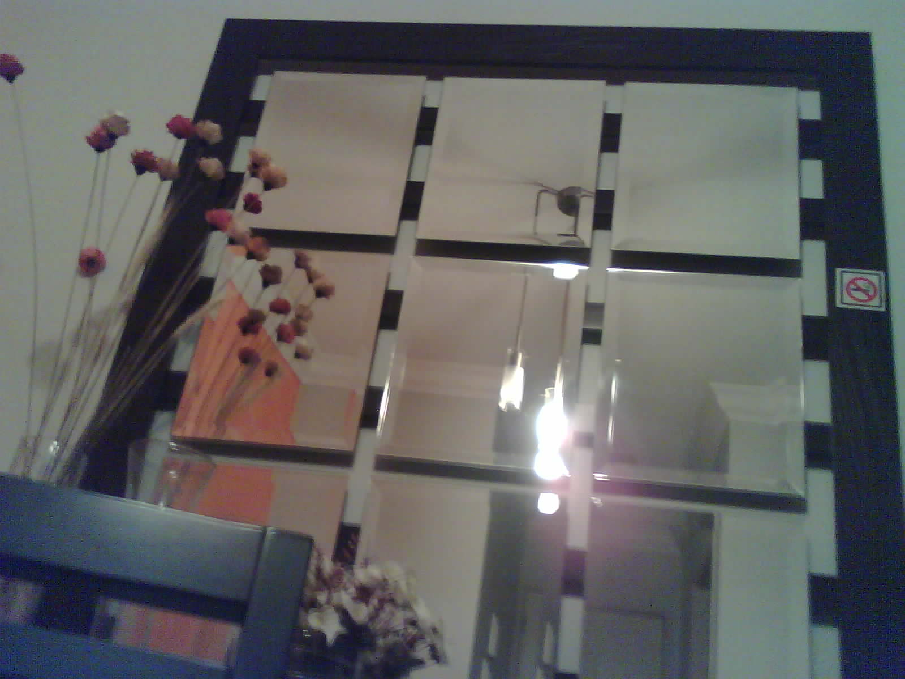

# Example http_jpg

Creates a http server and listen to `GET` requests at `http://[board-ip]/jpg`. When the request is triggered, it returns a UXGA JPEG image from the camera.

## Instructions

In order to run this example, you need to update your `esp-idf` repository to the main branch because it relies uppon `esp_http_server` which aren't released to this date.

> git clone https://github.com/espressif/esp-idf --recursive esp-idf

Then you need to configure your WiFi SSID and Password via `make menuconfig` or directly in [Kconfig.projbuild](./main/Kconfig.projbuild) file.

All camera pins are configured by default accordingly to [this A.I. Thinker document](../../assets/ESP32-CAM_Product_Specification.pdf) and you can check then inside [Kconfig.projbuild](./main/Kconfig.projbuild).

## Notes

Make sure to read [sdkconfig.defaults](./sdkconfig.defaults) file to get a grasp of required configurations to enable `PSRAM` and set it to `64MBit`.

## Demo

By default, the resolution is `UXGA` and bellow is a real photo taken by the module using this example.

